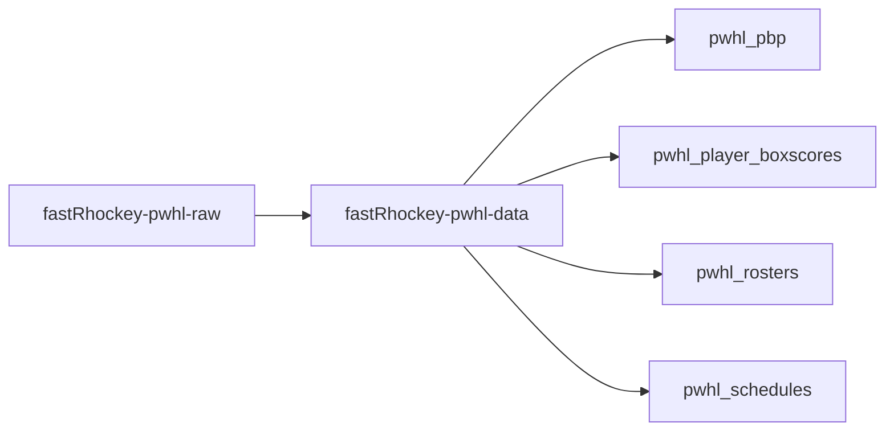
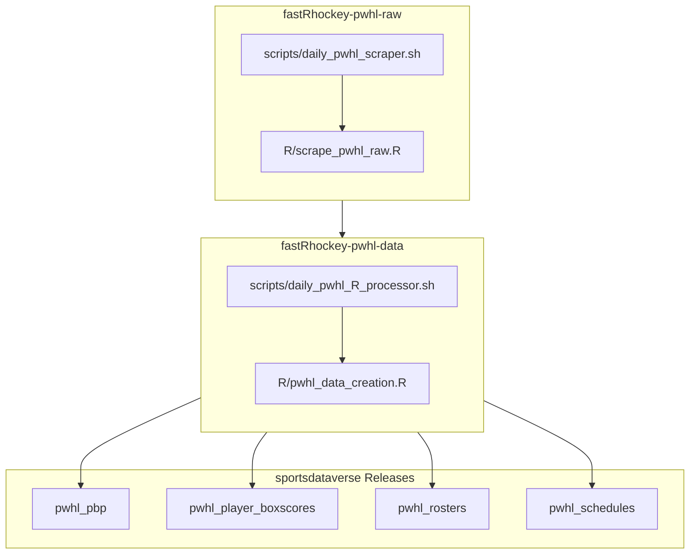

# fastRhockey-pwhl-data

Compiled PWHL datasets from [fastRhockey](https://github.com/sportsdataverse/fastRhockey), built from raw JSON in [fastRhockey-pwhl-raw](https://github.com/sportsdataverse/fastRhockey-pwhl-raw).



## fastRhockey PWHL workflow diagram



## Structure

```
pwhl/
├── pbp/
│   ├── rds/                  # Play-by-play per season (XZ compressed)
│   └── parquet/              # Play-by-play per season (GZIP compressed)
├── player_box/
│   ├── rds/                  # Player box scores per season
│   └── parquet/
├── rosters/
│   ├── rds/                  # Team rosters per season
│   └── parquet/
├── game_summary/
│   ├── rds/                  # Game summaries per season
│   └── parquet/
├── schedules/
│   ├── rds/                  # Season schedules
│   └── parquet/
├── pwhl_schedule_master.rds          # Combined schedule
├── pwhl_schedule_master.parquet
├── pwhl_games_in_data_repo.rds       # Games with PBP data
└── pwhl_games_in_data_repo.parquet
```

## Data Loading

Use the fastRhockey package to load data directly:

```r
library(fastRhockey)

# Play-by-play
pbp <- load_pwhl_pbp(2024)

# Player box scores
box <- load_pwhl_player_box(2024)

# Schedules
sched <- load_pwhl_schedule(2024)

# Rosters
rosters <- load_pwhl_rosters(2024)
```

## Automation

- Updated daily during PWHL season (Nov-May) via GitHub Actions
- Triggered automatically by [fastRhockey-pwhl-raw](https://github.com/sportsdataverse/fastRhockey-pwhl-raw) on push
- Uploads processed datasets to [sportsdataverse-data](https://github.com/sportsdataverse/sportsdataverse-data) releases

## sportsdataverse-data releases

| Release tag | Content |
|-----|---------|
| [`pwhl_schedules`](https://github.com/sportsdataverse/sportsdataverse-data/releases/tag/pwhl_schedules) | Season schedules |
| [`pwhl_pbp`](https://github.com/sportsdataverse/sportsdataverse-data/releases/tag/pwhl_pbp) | Play-by-play data |
| [`pwhl_player_boxscores`](https://github.com/sportsdataverse/sportsdataverse-data/releases/tag/pwhl_player_boxscores) | Player box scores (skaters + goalies) |
| [`pwhl_rosters`](https://github.com/sportsdataverse/sportsdataverse-data/releases/tag/pwhl_rosters) | Team rosters |

## Related repositories

[fastRhockey-pwhl-raw data repository (source: HockeyTech API)](https://github.com/sportsdataverse/fastRhockey-pwhl-raw)

[fastRhockey-pwhl-data repository (source: HockeyTech API)](https://github.com/sportsdataverse/fastRhockey-pwhl-data)

[fastRhockey-nhl-raw data repository (source: NHL API)](https://github.com/sportsdataverse/fastRhockey-nhl-raw)

[fastRhockey-nhl-data repository (source: NHL API)](https://github.com/sportsdataverse/fastRhockey-nhl-data)

[fastRhockey-data legacy repository (archived; sources: NHL Stats API + PHF)](https://github.com/sportsdataverse/fastRhockey-data)

## Part of the [SportsDataverse](https://sportsdataverse.org/)
