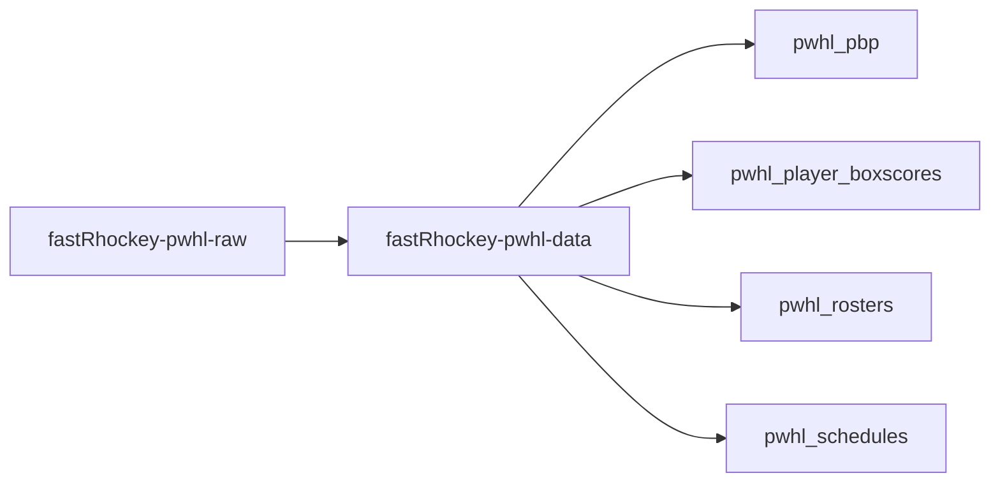
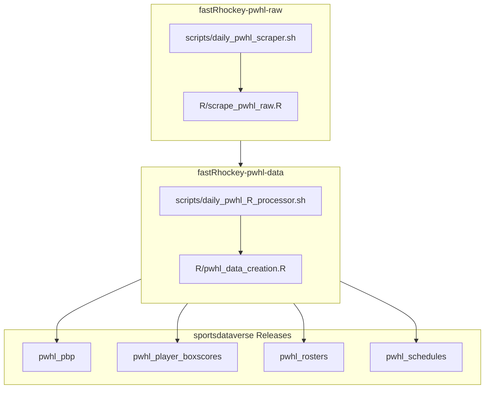

# fastRhockey-pwhl-data

Compiled PWHL datasets from [fastRhockey](https://github.com/sportsdataverse/fastRhockey), built from raw JSON in [fastRhockey-pwhl-raw](https://github.com/sportsdataverse/fastRhockey-pwhl-raw).


```mermaid
  graph LR;
    A[fastRhockey-pwhl-raw]-->B[fastRhockey-pwhl-data];
    B[fastRhockey-pwhl-data]-->C1[pwhl_pbp];
    B[fastRhockey-pwhl-data]-->C2[pwhl_player_boxscores];
    B[fastRhockey-pwhl-data]-->C3[pwhl_rosters];
    B[fastRhockey-pwhl-data]-->C4[pwhl_schedules];

```

## fastRhockey PWHL workflow diagram


```mermaid
flowchart TB;
    subgraph A[fastRhockey-pwhl-raw];
        direction TB;
        A1[scripts/daily_pwhl_scraper.sh]-->A2[R/scrape_pwhl_raw.R];
    end;

    subgraph B[fastRhockey-pwhl-data];
        direction TB;
        B1[scripts/daily_pwhl_R_processor.sh]-->B2[R/pwhl_data_creation.R];
    end;

    subgraph C[sportsdataverse Releases];
        direction TB;
        C1[pwhl_pbp];
        C2[pwhl_player_boxscores];
        C3[pwhl_rosters];
        C4[pwhl_schedules];
    end;

    A-->B;
    B-->C1;
    B-->C2;
    B-->C3;
    B-->C4;

    click C1 "https://github.com/sportsdataverse/sportsdataverse-data/releases/tag/pwhl_pbp" _blank;
    click C2 "https://github.com/sportsdataverse/sportsdataverse-data/releases/tag/pwhl_player_boxscores" _blank;
    click C3 "https://github.com/sportsdataverse/sportsdataverse-data/releases/tag/pwhl_rosters" _blank;
    click C4 "https://github.com/sportsdataverse/sportsdataverse-data/releases/tag/pwhl_schedules" _blank;

```

## Structure

```
pwhl/
├── pbp/
│   ├── rds/                  # Play-by-play per season (XZ compressed)
│   └── parquet/              # Play-by-play per season (GZIP compressed)
├── player_box/
│   ├── rds/                  # Player box scores per season
│   └── parquet/
├── rosters/
│   ├── rds/                  # Team rosters per season
│   └── parquet/
├── game_summary/
│   ├── rds/                  # Game summaries per season
│   └── parquet/
├── schedules/
│   ├── rds/                  # Season schedules
│   └── parquet/
├── pwhl_schedule_master.rds          # Combined schedule
├── pwhl_schedule_master.parquet
├── pwhl_games_in_data_repo.rds       # Games with PBP data
└── pwhl_games_in_data_repo.parquet
```

## Data Loading

Use the fastRhockey package to load data directly:

```r
library(fastRhockey)

# Play-by-play
pbp <- load_pwhl_pbp(2024)

# Player box scores
box <- load_pwhl_player_box(2024)

# Schedules
sched <- load_pwhl_schedule(2024)

# Rosters
rosters <- load_pwhl_rosters(2024)
```

## Reports & explainers

<!-- BEGIN GENERATED: reports -->

| Report | What it is | Last updated |
|---|---|---|
| [Model registry](models/REGISTRY.md) | model | artifact | gates | retrain, one row per published model | 2026-09-01 |
| [Model reports & cards](docs/models/) | 1 files, one per item | uncommitted |

<!-- END GENERATED: reports -->

## Automation & status

<!-- BEGIN GENERATED: status -->

| workflow | schedule | last run |
|---|---|---|
| [](https://github.com/sportsdataverse/fastRhockey-pwhl-data/actions/workflows/daily_pwhl.yml) | on dispatch | 2026-07-18 |
| [](https://github.com/sportsdataverse/fastRhockey-pwhl-data/actions/workflows/daily_pwhl_python.yml) | daily 09:00 UTC in Nov-Dec; daily 09:00 UTC in Jan-Mar; daily 09:00 UTC in Apr-May | never run |
| [](https://github.com/sportsdataverse/fastRhockey-pwhl-data/actions/workflows/pwhl_xg_cron.yml) | daily 14:00 UTC in Jan-May; daily 14:00 UTC in Nov-Dec | never run |

| release tag | assets | size | last publish |
|---|---:|---:|---|
| [`pwhl_pbp`](https://github.com/sportsdataverse/sportsdataverse-data/releases/tag/pwhl_pbp) | 14 | 23.0 MB | 2026-07-22 |
| [`pwhl_player_boxscores`](https://github.com/sportsdataverse/sportsdataverse-data/releases/tag/pwhl_player_boxscores) | 13 | 1.3 MB | 2026-07-22 |
| [`pwhl_rosters`](https://github.com/sportsdataverse/sportsdataverse-data/releases/tag/pwhl_rosters) | 13 | 0.2 MB | 2026-07-18 |
| [`pwhl_schedules`](https://github.com/sportsdataverse/sportsdataverse-data/releases/tag/pwhl_schedules) | 19 | 0.4 MB | 2026-07-18 |

<!-- END GENERATED: status -->
- Updated daily during PWHL season (Nov-May) via GitHub Actions
- Triggered automatically by [fastRhockey-pwhl-raw](https://github.com/sportsdataverse/fastRhockey-pwhl-raw) on push
- Uploads processed datasets to [sportsdataverse-data](https://github.com/sportsdataverse/sportsdataverse-data) releases

## sportsdataverse-data releases

| Release tag | Content |
|-----|---------|
| [`pwhl_schedules`](https://github.com/sportsdataverse/sportsdataverse-data/releases/tag/pwhl_schedules) | Season schedules |
| [`pwhl_pbp`](https://github.com/sportsdataverse/sportsdataverse-data/releases/tag/pwhl_pbp) | Play-by-play data |
| [`pwhl_player_boxscores`](https://github.com/sportsdataverse/sportsdataverse-data/releases/tag/pwhl_player_boxscores) | Player box scores (skaters + goalies) |
| [`pwhl_rosters`](https://github.com/sportsdataverse/sportsdataverse-data/releases/tag/pwhl_rosters) | Team rosters |

## Related repositories

[fastRhockey-pwhl-raw data repository (source: HockeyTech API)](https://github.com/sportsdataverse/fastRhockey-pwhl-raw)

[fastRhockey-pwhl-data repository (source: HockeyTech API)](https://github.com/sportsdataverse/fastRhockey-pwhl-data)

[fastRhockey-nhl-raw data repository (source: NHL API)](https://github.com/sportsdataverse/fastRhockey-nhl-raw)

[fastRhockey-nhl-data repository (source: NHL API)](https://github.com/sportsdataverse/fastRhockey-nhl-data)

[fastRhockey-data legacy repository (archived; sources: NHL Stats API + PHF)](https://github.com/sportsdataverse/fastRhockey-data)

## Part of the [SportsDataverse](https://sportsdataverse.org/)
