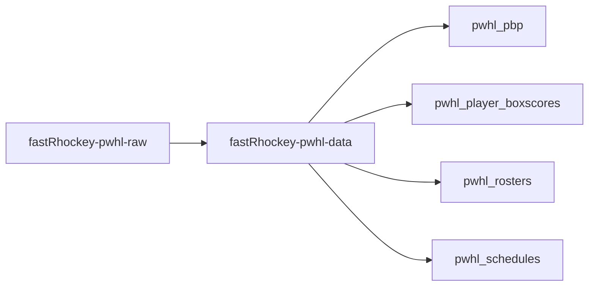
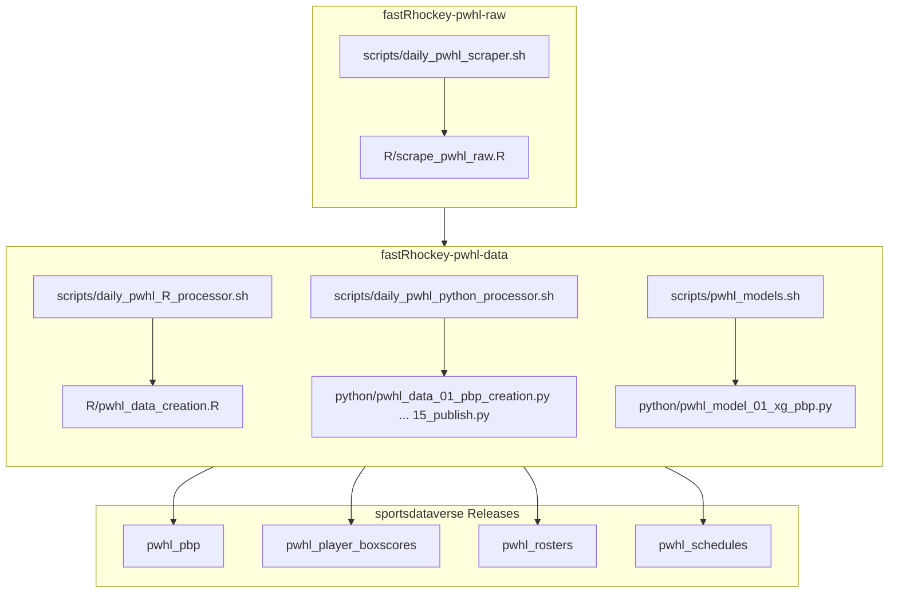

# fastRhockey-pwhl-data

Compiled PWHL datasets from [fastRhockey](https://github.com/sportsdataverse/fastRhockey), built from raw JSON in [fastRhockey-pwhl-raw](https://github.com/sportsdataverse/fastRhockey-pwhl-raw).


```mermaid
  graph LR;
    A[fastRhockey-pwhl-raw]-->B[fastRhockey-pwhl-data];
    B[fastRhockey-pwhl-data]-->C1[pwhl_pbp];
    B[fastRhockey-pwhl-data]-->C2[pwhl_player_boxscores];
    B[fastRhockey-pwhl-data]-->C3[pwhl_rosters];
    B[fastRhockey-pwhl-data]-->C4[pwhl_schedules];

```

## fastRhockey PWHL workflow diagram


```mermaid
flowchart TB;
    subgraph A[fastRhockey-pwhl-raw];
        direction TB;
        A1[scripts/daily_pwhl_scraper.sh]-->A2[R/scrape_pwhl_raw.R];
    end;

    subgraph B[fastRhockey-pwhl-data];
        direction TB;
        B1[scripts/daily_pwhl_R_processor.sh]-->B2[R/pwhl_data_creation.R];
        B3[scripts/daily_pwhl_python_processor.sh]-->B4[python/pwhl_data_01_pbp_creation.py ... 15_publish.py];
        B5[scripts/pwhl_models.sh]-->B6[python/pwhl_model_01_xg_pbp.py];
    end;

    subgraph C[sportsdataverse Releases];
        direction TB;
        C1[pwhl_pbp];
        C2[pwhl_player_boxscores];
        C3[pwhl_rosters];
        C4[pwhl_schedules];
    end;

    A-->B;
    B-->C1;
    B-->C2;
    B-->C3;
    B-->C4;

    click C1 "https://github.com/sportsdataverse/sportsdataverse-data/releases/tag/pwhl_pbp" _blank;
    click C2 "https://github.com/sportsdataverse/sportsdataverse-data/releases/tag/pwhl_player_boxscores" _blank;
    click C3 "https://github.com/sportsdataverse/sportsdataverse-data/releases/tag/pwhl_rosters" _blank;
    click C4 "https://github.com/sportsdataverse/sportsdataverse-data/releases/tag/pwhl_schedules" _blank;

```

## Repository layout

<!-- BEGIN GENERATED: layout -->

```
fastRhockey-pwhl-data/
├── R/   # R pipeline stages and publish toolchain
│   ├── 0000_create_fastRhockey_releases_init.R
│   ├── 0001_push_existing_release_data.R
│   ├── pwhl_data_creation.R
│   └── run_summary.R
├── docs/   # explainers, model reports and dataset docs
│   └── models/
├── logs/   # per-run logs (gitignored where large)
├── models/   # model artifacts, cards and the registry
├── pwhl/
│   ├── game_info/
│   ├── game_rosters/
│   ├── game_summary/
│   ├── goalie_box/
│   ├── officials/
│   ├── pbp/
│   ├── penalty_summary/
│   ├── player_box/
│   └── … 9 more
├── pwhl_model_publish.egg-info/
├── python/   # Python pipeline stages, numbered in build order
│   ├── pwhl_data_build/
│   ├── pwhl_model_publish/
│   ├── pwhl_model_publish.egg-info/
│   ├── pwhl_data_01_pbp_creation.py
│   ├── pwhl_data_02_shifts_creation.py
│   ├── pwhl_data_03_skater_box_creation.py
│   ├── pwhl_data_04_goalie_box_creation.py
│   ├── pwhl_data_05_team_box_creation.py
│   ├── pwhl_data_06_game_info_creation.py
│   ├── pwhl_data_07_game_rosters_creation.py
│   ├── pwhl_data_08_scoring_summary_creation.py
│   ├── pwhl_data_09_penalty_summary_creation.py
│   ├── pwhl_data_10_three_stars_creation.py
│   ├── pwhl_data_11_officials_creation.py
│   ├── pwhl_data_12_shots_by_period_creation.py
│   ├── pwhl_data_13_shootout_creation.py
│   └── … 3 more
├── scripts/   # bash drivers (the daily/weekly entry points)
│   ├── daily_pwhl_R_processor.sh
│   ├── daily_pwhl_python_processor.sh
│   ├── pwhl_data.sh
│   ├── pwhl_models.sh
│   └── render_model_docs.sh
└── tests/   # test suite
    ├── pwhl_data_build/
    ├── test_builders.py
    ├── test_model_manifest.py
    └── test_model_registry.py
```

<!-- END GENERATED: layout -->

## Data Loading

Use the fastRhockey package to load data directly:

```r
library(fastRhockey)

# Play-by-play
pbp <- load_pwhl_pbp(2024)

# Player box scores
box <- load_pwhl_player_box(2024)

# Schedules
sched <- load_pwhl_schedule(2024)

# Rosters
rosters <- load_pwhl_rosters(2024)
```

## Reports & explainers

<!-- BEGIN GENERATED: reports -->

| Report | What it is | Last updated |
|---|---|---|
| [Model registry](models/REGISTRY.md) | model | artifact | gates | retrain, one row per published model | 2026-09-01 |
| [Model reports & cards](docs/models/) | 1 files, one per item | 2026-09-01 |

<!-- END GENERATED: reports -->

## Automation & status

<!-- BEGIN GENERATED: status -->

| workflow | schedule | last run |
|---|---|---|
| [](https://github.com/sportsdataverse/fastRhockey-pwhl-data/actions/workflows/daily_pwhl.yml) | on dispatch | 2026-07-18 |
| [](https://github.com/sportsdataverse/fastRhockey-pwhl-data/actions/workflows/daily_pwhl_python.yml) | daily 09:00 UTC in Nov-Dec; daily 09:00 UTC in Jan-Mar; daily 09:00 UTC in Apr-May | never run |
| [](https://github.com/sportsdataverse/fastRhockey-pwhl-data/actions/workflows/pwhl_xg_cron.yml) | daily 14:00 UTC in Jan-May; daily 14:00 UTC in Nov-Dec | never run |

| release tag | assets | size | last publish |
|---|---:|---:|---|
| [`pwhl_pbp`](https://github.com/sportsdataverse/sportsdataverse-data/releases/tag/pwhl_pbp) | 14 | 23.0 MB | 2026-07-22 |
| [`pwhl_player_boxscores`](https://github.com/sportsdataverse/sportsdataverse-data/releases/tag/pwhl_player_boxscores) | 13 | 1.3 MB | 2026-07-22 |
| [`pwhl_rosters`](https://github.com/sportsdataverse/sportsdataverse-data/releases/tag/pwhl_rosters) | 13 | 0.2 MB | 2026-07-18 |
| [`pwhl_schedules`](https://github.com/sportsdataverse/sportsdataverse-data/releases/tag/pwhl_schedules) | 19 | 0.4 MB | 2026-07-18 |

<!-- END GENERATED: status -->
- Updated daily during PWHL season (Nov-May) via GitHub Actions
- Triggered automatically by [fastRhockey-pwhl-raw](https://github.com/sportsdataverse/fastRhockey-pwhl-raw) on push
- Uploads processed datasets to [sportsdataverse-data](https://github.com/sportsdataverse/sportsdataverse-data) releases

## sportsdataverse-data releases

| Release tag | Content |
|-----|---------|
| [`pwhl_schedules`](https://github.com/sportsdataverse/sportsdataverse-data/releases/tag/pwhl_schedules) | Season schedules |
| [`pwhl_pbp`](https://github.com/sportsdataverse/sportsdataverse-data/releases/tag/pwhl_pbp) | Play-by-play data |
| [`pwhl_player_boxscores`](https://github.com/sportsdataverse/sportsdataverse-data/releases/tag/pwhl_player_boxscores) | Player box scores (skaters + goalies) |
| [`pwhl_rosters`](https://github.com/sportsdataverse/sportsdataverse-data/releases/tag/pwhl_rosters) | Team rosters |

## Related repositories

[fastRhockey-pwhl-raw data repository (source: HockeyTech API)](https://github.com/sportsdataverse/fastRhockey-pwhl-raw)

[fastRhockey-pwhl-data repository (source: HockeyTech API)](https://github.com/sportsdataverse/fastRhockey-pwhl-data)

[fastRhockey-nhl-raw data repository (source: NHL API)](https://github.com/sportsdataverse/fastRhockey-nhl-raw)

[fastRhockey-nhl-data repository (source: NHL API)](https://github.com/sportsdataverse/fastRhockey-nhl-data)

[fastRhockey-data legacy repository (archived; sources: NHL Stats API + PHF)](https://github.com/sportsdataverse/fastRhockey-data)

## Part of the [SportsDataverse](https://sportsdataverse.org/)

## Consumers

The packages that read what this repo produces:

- **R:** [fastRhockey](https://fastRhockey.sportsdataverse.org) — docs at <https://fastRhockey.sportsdataverse.org>
- **Python:** [`sportsdataverse.pwhl`](https://github.com/sportsdataverse/sportsdataverse-py) — docs at <https://py.sportsdataverse.org>

## Stage inventory

Every numbered pipeline stage in `python/` (auto-listed; run subsets with the `scripts/*.sh` drivers by number or name):

- `python/pwhl_data_01_pbp_creation.py`
- `python/pwhl_data_02_shifts_creation.py`
- `python/pwhl_data_03_skater_box_creation.py`
- `python/pwhl_data_04_goalie_box_creation.py`
- `python/pwhl_data_05_team_box_creation.py`
- `python/pwhl_data_06_game_info_creation.py`
- `python/pwhl_data_07_game_rosters_creation.py`
- `python/pwhl_data_08_scoring_summary_creation.py`
- `python/pwhl_data_09_penalty_summary_creation.py`
- `python/pwhl_data_10_three_stars_creation.py`
- `python/pwhl_data_11_officials_creation.py`
- `python/pwhl_data_12_shots_by_period_creation.py`
- `python/pwhl_data_13_shootout_creation.py`
- `python/pwhl_data_14_player_box_creation.py`
- `python/pwhl_data_15_publish.py`
- `python/pwhl_model_01_xg_pbp.py`

Model release tags published from here: `pwhl_xg_pbp`
