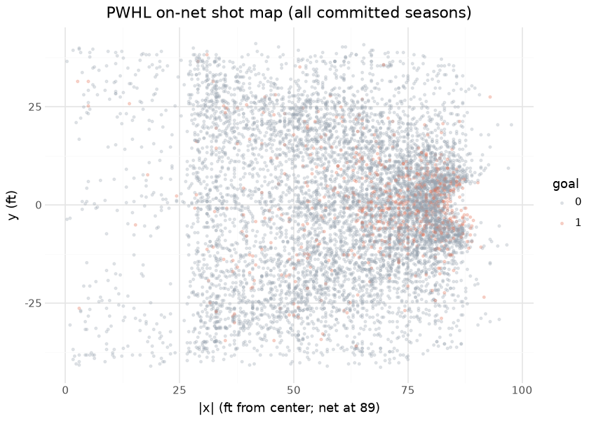
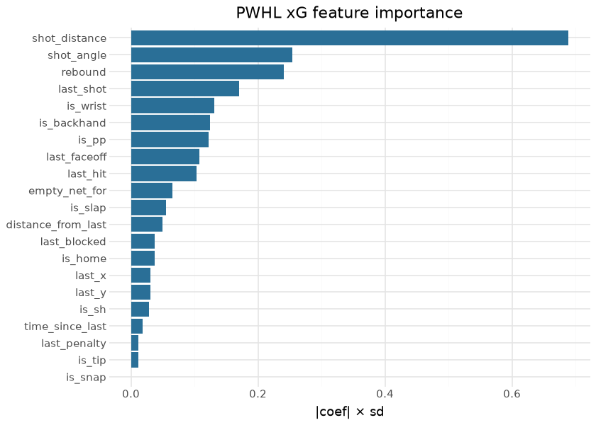
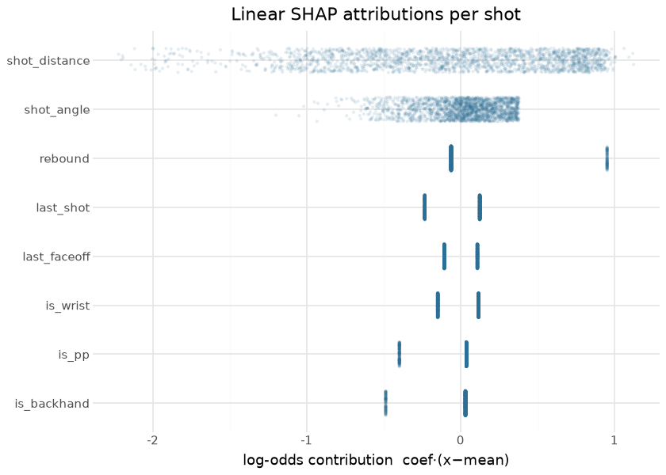
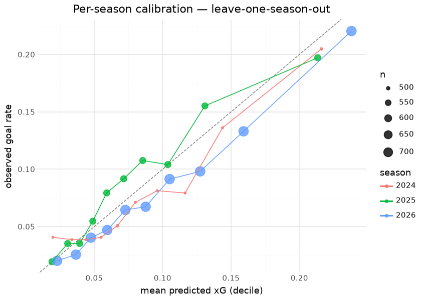

# PWHL Expected Goals — coordinate xG

The PWHL coordinate expected-goals model estimates the probability that
an on-net shot becomes a goal, from pre-shot information only: shot
geometry (distance and angle to the net, derived from the HockeyTech
rink coordinates), shot type, rebound state, and the pre-shot movement
context (what the previous event was, how long ago, and how far away).
It is a **logistic regression fit at call time** in sdv-py
(`sportsdataverse.pwhl.pwhl_xg_proxy.fit_pwhl_coord_xg`) — there is no
bundled artifact; the model is a deterministic function of the
play-by-play it is handed, which is what makes this document fully
reproducible from the data committed in this repository. A per-strength
(EV/PP/SH) Platt recalibration is applied on top of the base logit when
the frame carries strength columns. An alternative “shot-quality tier”
proxy exists for API stability but is not the production scorer; its two
goal-named tiers tautologically encode the outcome, a limitation the
module documents openly.

This document is the model’s reproducible writeup: every number, figure
and table below is computed at render time from the committed
play-by-play parquet in `pwhl/pbp/parquet/`.

## Training data

| PWHL committed play-by-play, by season |  |  |  |  |  |  |
|----|----|----|----|----|----|----|
| on-net shots (event == 'shot'); computed at render time |  |  |  |  |  |  |
| season | games | pbp_events | shots | goals | goal_rate | coord_coverage |
| 2024 | 85 | 10,456 | 4,922 | 385 | 7.8% | 100.0% |
| 2025 | 102 | 12,520 | 5,671 | 499 | 8.8% | 100.0% |
| 2026 | 133 | 23,838 | 7,438 | 601 | 8.1% | 100.0% |

&#10;

The corpus is every season of PWHL play-by-play this repository has
compiled (the league launched in 2024), with shot coordinates at
effectively full coverage — the reason a coordinate xG is viable here at
all. `strength_state` exists league-wide because of the game-shifts
backfill (T5/R4), and enters the model through the `is_pp` / `is_sh`
strength one-hots and the per-strength recalibrator rather than as a raw
feature.

One data defect is recomputed at every render so it cannot silently go
stale. From 2025-26 the feed carries `shot_distance` / `shot_angle`
columns; earlier seasons do not. `pwhl_xg_proxy._shot_geometry()` reuses
those columns whenever they are present, so in a **pooled** multi-season
frame every earlier-season shot keeps a null distance, which
`_build_xg_features` then fills with 0.0 — the production publisher
(`pwhl_model_publish.builders.build_xg`) fits once on exactly such a
pooled frame. This document drops the feed geometry and recomputes it
from the coordinates (lossless; the two agree to 0.0 ft on 2025-26), so
every number below is on real geometry. The count goes to zero when
sdv-py’s `_shot_geometry` recomputes null geometry:

| Pooled-frame geometry contamination — recomputed at render time |  |  |
|----|----|----|
| sdv-py pwhl_xg_proxy.\_shot_geometry reuses feed geometry columns even where they are null |  |  |
| pooled on-net shots with coordinates | null shot_distance after \_shot_geometry (would train at 0 ft) | share |
| 18,031 | 10,593 | 58.7% |

&#10;

## Exploratory data analysis

| Shot mix and conversion by strength state |        |           |
|-------------------------------------------|--------|-----------|
| strength_state                            | shots  | goal_rate |
| <na>                                      | 10,640 | 8.5%      |
| 5v5                                       | 4,817  | 8.1%      |
| 5v4                                       | 759    | 4.7%      |
| 4v5                                       | 692    | 4.8%      |
| 5v3                                       | 133    | 8.3%      |
| 4v4                                       | 131    | 6.1%      |
| 5v6                                       | 117    | 7.7%      |
| 6v5                                       | 114    | 8.8%      |

&#10;

The distance curve is the core of the model: conversion drops from over
20% at the crease to low single digits beyond ~45 ft, and it is smooth
enough that a logistic in distance and angle captures most of the
signal. The strength-state table shows why strength enters the model:
power-play shots convert at a visibly higher rate than even-strength
shots from a similar mix of locations.

## Model, features & importance

| Logistic coefficients and standardized importance |  |  |
|----|----|----|
| importance = \|coef\| × sd(feature), full-corpus fit |  |  |
| feature | coefficient | std_importance |
| shot_distance | −0.0360 | 0.6884 |
| shot_angle | −0.0124 | 0.2543 |
| rebound | 1.0138 | 0.2408 |
| last_shot | −0.3573 | 0.1704 |
| is_wrist | −0.2650 | 0.1316 |
| is_backhand | −0.5181 | 0.1250 |
| is_pp | −0.4348 | 0.1226 |
| last_faceoff | −0.2151 | 0.1075 |
| last_hit | −0.3939 | 0.1031 |
| empty_net_for | 0.7441 | 0.0651 |
| is_slap | 0.2658 | 0.0556 |
| distance_from_last | 0.0011 | 0.0492 |
| last_blocked | −0.1542 | 0.0376 |
| is_home | 0.0742 | 0.0371 |
| last_x | 0.0005 | 0.0312 |
| last_y | 0.0014 | 0.0305 |
| is_sh | 0.1386 | 0.0282 |
| time_since_last | 0.0005 | 0.0182 |
| last_penalty | 0.2157 | 0.0120 |
| is_tip | −0.0574 | 0.0112 |
| is_snap | 0.0011 | 0.0003 |

&#10;

## SHAP-style attribution

For a linear-logit model the exact Shapley attribution of each feature
on the log-odds scale is `coef × (x − E[x])` — no approximation needed.
The distribution of per-shot attributions shows how each feature moves
individual shots, not just the average:

Distance dominates — its attributions span roughly ±1 log-odds — with
rebound state the strongest binary: a rebound shot gains about one
log-odds (odds ×2.7) over a non-rebound shot from the same location.

## Evaluation

The honest test for a young league is a **season holdout**: fit on all
seasons before the newest, score the newest, and compare against a
constant-rate baseline.

| Season-holdout evaluation — fit 2024–2025, scored on 2026 |         |          |
|-----------------------------------------------------------|---------|----------|
| 7,438 held-out shots, goal rate 0.081                     |         |          |
| model                                                     | logloss | rank_AUC |
| coordinate xG                                             | 0.2627  | 0.7033   |
| constant baseline (train goal rate)                       | 0.2808  | 0.5000   |

&#10;

The model beats the constant baseline on the held-out season and its
decile calibration tracks the diagonal. The published per-season assets
on the `pwhl_xg_pbp` release tag are scored by the same recipe with the
full corpus available at publish time; their in-sample evaluation lives
in [`pwhl_xg_eval_card.json`](pwhl_xg_eval_card.json).

## Per-season calibration

Three seasons now exist — enough to ask whether calibration holds season
by season as the league matures, not only on the newest one. Each season
is scored **leave-one-season-out**: the model is re-fit on the other
seasons and predicts the held-out one, so no season is scored by a model
that saw it. The per-season decile curves and the binomial calibration
z-score (`z = (goals − ΣxG) / sqrt(ΣxG · (1 − xG))`; a calibrated season
has \|z\| ≲ 2 whatever its shot count) are computed at render time and
extend automatically as seasons land.

| Per-season calibration — leave-one-season-out |  |  |  |  |  |  |  |
|----|----|----|----|----|----|----|----|
| each season scored by a model fit on the other committed seasons |  |  |  |  |  |  |  |
| season | shots | goals | xG | goals_per_xG | z | logloss | rank_AUC |
| 2024 | 4,922 | 385 | 429.2 | 0.897 | −2.282 | 0.261 | 0.676 |
| 2025 | 5,671 | 499 | 455.0 | 1.097 | 2.199 | 0.281 | 0.688 |
| 2026 | 7,438 | 601 | 711.7 | 0.844 | −4.473 | 0.263 | 0.703 |

&#10;

Read the table with the z column first: a season outside \|z\| ≈ 2 is
one the other seasons’ shot-quality mix does not price correctly, and
the decile curve for that season shows *where* (crease vs perimeter) the
miss sits. Two data facts shape these rows. First, `strength_state`
coverage differs sharply by season (the 2024 and 2025 parquets carry no
skater/strength columns at all, 2026 is ~99% covered — see the strength
table above), so the `is_pp` / `is_sh` features and the per-strength
recalibrator are effectively active only for 2026 shots, and a model fit
without 2026 has no strength features at all. Second, the frames are
normalized at load (see the setup cell): the feed’s geometry columns are
dropped and recomputed from coordinates, and the skater columns exist
(null) in every season. Without the latter, `predict()` on a lone
2024/2025 frame zero-fills the whole strength block *including*
`is_home` and returns ~25% lower xG for the same rows; without the
former, a pooled fit trains 58% of its shots at distance 0 (the
contamination table above).

## Results — players and teams

| Top 15 skaters by expected goals — 2026 season |  |  |  |  |  |  |
|----|----|----|----|----|----|----|
| xG summed over on-net shots; GAX = goals above expected |  |  |  |  |  |  |
|  | Player | Team | Shots | xG | G | GAX |
|  | Rebecca Leslie | OTT | 93 | 9.11 | 14 | 4.89 |
|  | Laura Stacey | MTL | 113 | 9.09 | 9 | −0.09 |
|  | Grace Zumwinkle | MIN | 76 | 7.75 | 11 | 3.25 |
|  | Hayley Scamurra | MTL | 70 | 7.59 | 9 | 1.41 |
|  | Jessie Eldridge | BOS | 83 | 7.45 | 13 | 5.55 |
|  | Alina Müller | BOS | 67 | 7.30 | 4 | −3.30 |
|  | Sarah Fillier | NY | 73 | 6.27 | 8 | 1.73 |
|  | Taylor Heise | MIN | 90 | 6.19 | 12 | 5.81 |
|  | Emily Clark | OTT | 63 | 6.13 | 3 | −3.13 |
|  | Alex Carpenter | SEA | 62 | 5.88 | 7 | 1.12 |
|  | Abby Roque | MTL | 71 | 5.83 | 9 | 3.17 |
|  | Brianne Jenner | OTT | 66 | 5.74 | 9 | 3.26 |
|  | Kelly Pannek | MIN | 54 | 5.57 | 14 | 8.43 |
|  | Shiann Darkangelo | MTL | 54 | 5.53 | 4 | −1.53 |
|  | Sarah Nurse | VAN | 66 | 5.53 | 8 | 2.47 |

&#10;

| Team shot generation — 2026 season |       |        |           |             |
|------------------------------------|-------|--------|-----------|-------------|
| team                               | games | xG_for | goals_for | xG_per_game |
| New York Sirens                    | 21    | 49.67  | 43        | 2.37        |
| Boston Fleet                       | 26    | 60.12  | 58        | 2.31        |
| Montréal Victoire                  | 32    | 73.89  | 81        | 2.31        |
| Minnesota Frost                    | 27    | 61.50  | 77        | 2.28        |
| Seattle Torrent                    | 23    | 50.23  | 47        | 2.18        |
| Ottawa Charge                      | 29    | 60.48  | 66        | 2.09        |
| Toronto Sceptres                   | 21    | 42.46  | 33        | 2.02        |
| Vancouver Goldeneyes               | 21    | 41.54  | 53        | 1.98        |

&#10;

Positive GAX identifies finishers beating their shot quality; sustained
negative GAX at high xG identifies volume shooters running cold. Because
the league is three seasons old these player samples are small — GAX
here is a descriptive ledger, not a talent estimate.

## Provenance & reproducibility

- **Trained on:** every committed PWHL season in this repository
  (`pwhl/pbp/parquet/play_by_play_{2024..}.parquet`); the holdout
  evaluation fits on all seasons except the newest and scores the
  newest.
- **Model spec:** `sportsdataverse.pwhl.pwhl_xg_proxy.fit_pwhl_coord_xg`
  (logistic regression + per-strength Platt recalibration); no bundled
  artifact — deterministic re-fit from data.
- **Rebuild this document:** `scripts/render_model_docs.sh` (Quarto →
  GFM; uses this repo’s `.venv` via `QUARTO_PYTHON`; deps in the `docs`
  group: `uv sync --group docs`).
- **Production surface:** stage `python/pwhl_model_01_xg_pbp.py`
  publishes xG-enriched per-season parquet to the `pwhl_xg_pbp` release
  tag (`pwhl_xg_cron.yml`); per-publish metadata in the card sidecars.
  Single home: `models/manifest.yaml`; registry row:
  `models/REGISTRY.md`.

## Avenues for improvement & open issues

- **EV/PP/SH-split models** — catalogued in `dev/t5_xg_reevaluation/`;
  the league-wide `strength_state` column exists precisely to enable
  this.
- **Resolved (2026-09-01, PR \#5):** *Per-season calibration drift* —
  the leave-one-season-out table and decile curves above recompute
  per-season calibration (goals/ΣxG, binomial z, AUC) at every render
  and extend automatically as seasons land.
- **Pre-shot passing data does not exist publicly** — royal-road
  one-timers are under-rated by construction; honest gains come from
  better rebound and rush definitions, not more features.
- **Known issue:** the published-release evaluation is in-sample; this
  document’s season-holdout is the honest gate, and it should be re-run
  as each new season lands (the render does this automatically).
- **Known issue (measured 2026-09-01):** *pooled-fit geometry
  contamination* — `pwhl_xg_proxy._shot_geometry` reuses the feed’s
  `shot_distance`/`shot_angle` when the columns exist, so in a pooled
  frame the pre-2025-26 seasons (which lack them) keep null geometry
  that `_build_xg_features` fills with 0.0: 10,593 of 18,031 pooled
  shots (58%) train at distance 0. The production publisher fits on
  exactly that pooled frame, so the published `pwhl_xg_pbp` assets are
  affected until sdv-py recomputes null geometry (the table in *Training
  data* re-measures it every render). This document works around it by
  dropping the feed geometry at load.
- **Known issue (measured 2026-09-01):** *lone early-season scoring* — a
  2024 or 2025 frame scored on its own lacks the skater columns, so
  `predict()` zero-fills `is_home` together with the strength block
  (~25% lower xG for the same rows). The load step here adds the columns
  as null; the durable fix is for `_build_xg_features` not to tie
  `is_home` to the skater columns.
