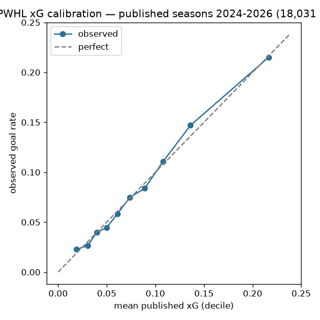

# PWHL xG-enriched shots — model documentation

`pwhl_xg_pbp_{season}.parquet` per season on the `pwhl_xg_pbp` tag, plus a
`pwhl_xg_pbp_card.json` provenance sidecar per publish (the per-run metadata
authority).

## Model

The xG proxy model itself lives in sdv-py
(`sportsdataverse.pwhl.pwhl_xg_proxy` / `pwhl_shot_xg()`) — its fit and gates
are registered where it is trained. This repo owns the SCORING + publish
surface: the committed play-by-play (with `strength_state` derived via the
gameshifts backfill, T5/R4) is scored per season and published.

## Operability

Stage `python/pwhl_model_01_xg_pbp.py` (wraps `pwhl_model_publish xg`); daily
in-season cron Nov-May (`pwhl_xg_cron.yml`) + dispatch. The publisher REFUSES
a season with no committed pbp — it fail-fasts rather than scoring an empty
season. Single home: `models/manifest.yaml`.

## Evaluation on the published releases (2026-09-01)

18,031 scored shots across seasons 2024-2026: log-loss **0.2639**, Monte-Carlo rank AUC **0.707**, goal rate 0.0824. In-sample calibration of the published scores; the proxy's own fit and gates live in sdv-py.

Card: [`pwhl_xg_eval_card.json`](pwhl_xg_eval_card.json)

## Figures

